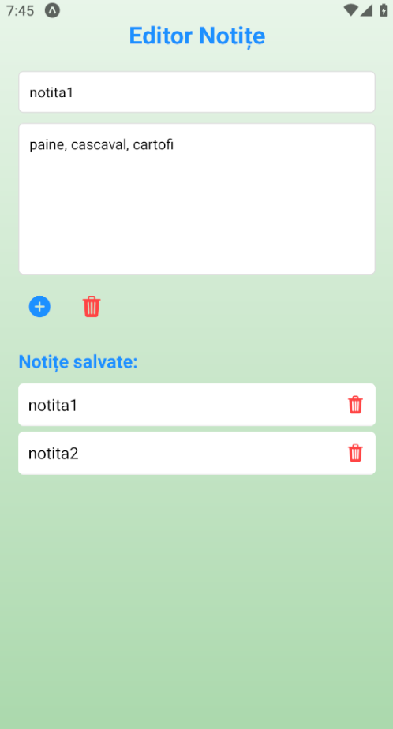

# Notes-React_Native-App

Download apk file: https://drive.google.com/file/d/1AZsQIhv0dWXECHav-ULs1sIcS_S9GRf5/view?usp=sharing

Text Editor (Notes) app for Android, developed with React Native, Expo and Genymotion(Android Emulator).

Visual Studio Code Extensions: Babel JS, React Native Tools

How to use:

Open Genymotion, Start

>npx create-expo-app Notes --template

select Blank TypeScript

>cd Notes

copy App.tsx to Notes/

>npx expo start

type a
